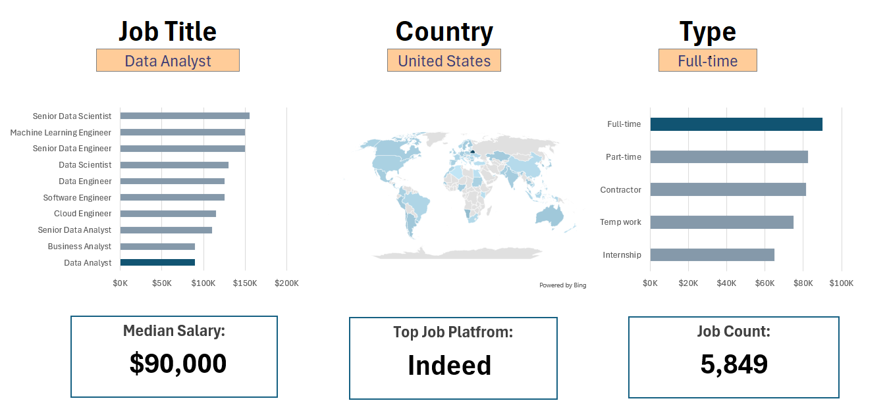
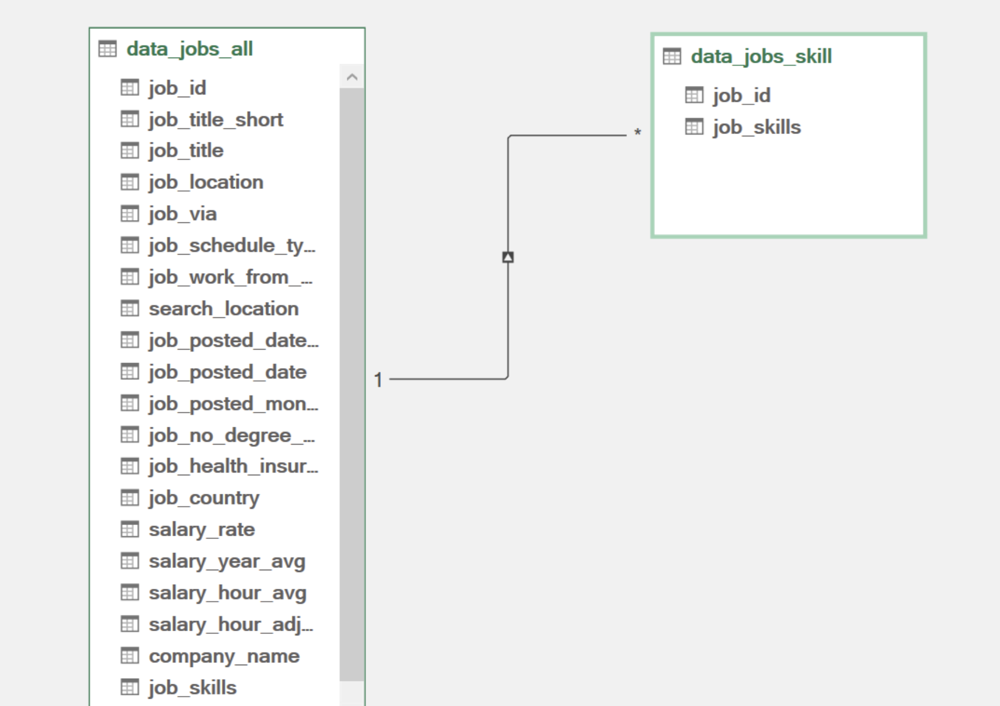

# 📊 Excel Data Analytics Projects

This repository contains two Excel data analytics projects focused on **job market salaries, skill demand, and data-related career trends**.

The goal of this portfolio is to demonstrate my ability to use Excel for data cleaning, analysis, visualization, and dashboard creation. These projects use tools such as **PivotTables, PivotCharts, slicers, Power Query, Power Pivot, DAX, data validation, and interactive dashboard design**.

---

## 📌 Project Overview

| Project | Description | Skills Demonstrated |
|---|---|---|
| [📈 Data Science Salary Dashboard](Project_1_Salary_Dashboard/) | Interactive Excel dashboard for exploring salary trends by job title, country, and employment type | Dashboard design, Excel formulas, data validation, charts, interactive filtering |
| [🧠 Job Skills & Salary Analysis](Project_2_Job_Skills_Analysis/) | Excel analysis workbook exploring skill demand, salary trends, and job role comparisons | PivotTables, PivotCharts, slicers, Power Query, Power Pivot, DAX, data modeling |

---

## 📈 Project 1: Data Science Salary Dashboard

📂 **Folder:** [`Project_1_Salary_Dashboard`](Project_1_Salary_Dashboard/)  
📄 **Workbook:** `Salary_Dashboard_Project_23-25.xlsx`

This project is an interactive Excel dashboard that allows users to explore salary data for data-related jobs.

Users can filter the dashboard by:

- Job title
- Country
- Employment type

The dashboard also includes summary KPI cards for **median salary**, **top job platform**, and **job count**.

### 📸 Dashboard Preview

### 🎥 Interactive Dashboard Demo

### 🔍 Key Features

- Interactive salary dashboard
- Dropdown filters for job title, country, and employment type
- Salary comparison by job title
- Salary comparison by employment type
- Country-based salary map
- KPI cards for median salary, top job platform, and job count

### 🛠️ Skills Used

- Excel formulas
- Data validation
- Charts
- Dashboard design
- Data cleaning
- Interactive filtering

### 💡 Key Takeaways

- Senior and engineering-focused data roles generally show higher median salaries.
- Salary varies depending on job title, country, and employment type.
- Interactive dashboards make job market data easier to explore and understand.

---

## 🧠 Project 2: Job Skills & Salary Analysis

📂 **Folder:** [`Project_2_Job_Skills_Analysis`](Project_2_Job_Skills_Analysis/)  
📄 **Workbook:** `Project_2.xlsx`

This project analyzes the relationship between job skills, salaries, job titles, and skill demand in the data job market.

The workbook includes multiple analysis sheets using **PivotTables, PivotCharts, slicers, Power Query, Power Pivot, and DAX measures**.

### 🔍 Questions Explored

- What skills are most commonly requested for data-related jobs?
- Which skills are associated with higher salaries?
- Do jobs that request more skills tend to pay more?
- How do U.S. and non-U.S. salaries compare?
- How does skill demand compare with median salary?

---

### 📊 Salary vs. Skills Requested

This scatter plot compares **median salary** with the **average number of skills requested per job posting**.

### 🌎 U.S. vs. Non-U.S. Salary Analysis

This analysis compares median salaries by job title between U.S. and non-U.S. roles.

### 🧰 Top Skills in Job Postings

This chart shows the most commonly requested skills in data-related job postings.

### 💰 Skill Salary Analysis

This analysis compares skill likelihood with median salary to understand which skills are both common and valuable.

---

## 🧹 Power Query Data Cleaning

Power Query was used to clean and transform the raw job market data before analysis.

### Job Posting Dataset Cleaning

### Skills Dataset Cleaning

Cleaning steps included:

- Promoting headers
- Changing data types
- Replacing values
- Splitting skill columns by delimiter
- Unpivoting skill columns
- Trimming and standardizing skill names
- Creating conditional columns
- Removing unnecessary columns
- Renaming final columns

---

## 🔗 Power Pivot Data Model

Power Pivot was used to build a relationship between the job posting table and the job skills table using `job_id`.

This allowed the analysis to connect each job posting with its related skills and build PivotTables across multiple tables.

---

## 🛠️ Tools Used

- Microsoft Excel
- PivotTables
- PivotCharts
- Power Query
- Power Pivot
- DAX
- Data validation
- Slicers
- GitHub

---

## 📚 What I Learned

Through these projects, I practiced turning raw job market data into clear Excel analysis and dashboards.

I learned how to:

- Clean and organize datasets
- Build PivotTables and PivotCharts
- Create interactive dashboards
- Use slicers and filters
- Build relationships with Power Pivot
- Write DAX measures
- Analyze salary and skill trends
- Present findings in a clear and readable format

---

## 🎯 Portfolio Purpose

These projects are part of my data analytics portfolio as I continue building skills for entry-level roles such as:

- Data Analyst
- Business Analyst
- Finance Analyst

This repository is intended to show my progress in Excel, data analysis, dashboard creation, and business-style reporting.